# Local-First Agent Memory Store Architecture

**Document status:** Architecture design draft  
**Generated:** 2026-06-13  
**Primary source:** `prompt.md`  
**System:** Lightweight, portable, local-first Python memory store for AI agents  

---

## 0. Source Traceability

This architecture document is derived from the attached implementation prompt, referenced throughout as `prompt.md`. Section references use the form `prompt.md §N`.

| Architecture Area | Source Reference |
|---|---|
| Product goal and record families | `prompt.md §1` |
| V1 boundaries and non-goals | `prompt.md §2`, `prompt.md §20` |
| Tech stack | `prompt.md §3` |
| Package/module boundaries | `prompt.md §4` |
| Public Python API | `prompt.md §5` |
| Memory types and promotion model | `prompt.md §6` |
| Core data model | `prompt.md §7` |
| ArcadeDB schema/index/graph requirements | `prompt.md §8` |
| Separate lifecycle rules | `prompt.md §9` |
| Markdown ingestion | `prompt.md §10` |
| Retrieval pipeline | `prompt.md §11` |
| Final scoring | `prompt.md §12` |
| Operational safety and privacy | `prompt.md §13` |
| REST wrapper | `prompt.md §14` |
| Configuration | `prompt.md §15` |
| CLI | `prompt.md §16` |
| Evaluation suite | `prompt.md §17` |
| Testing requirements | `prompt.md §18` |
| Documentation requirements | `prompt.md §19` |
| Acceptance criteria | `prompt.md §21` |
| Implementation style | `prompt.md §22` |

---

## 1. Executive Summary

The system is a **local-first Python memory persistence layer for AI agents**. It provides a durable, inspectable, testable, and portable memory store that supports both mutable agent memories and deterministic source-controlled document chunks.

The architecture is intentionally **embedded and single-process first**. ArcadeDB Embedded acts as the only persistence engine for records, vectors, full-text indexes, metadata indexes, and lightweight graph relationships. FastEmbed provides local embeddings and optional reranking. The primary interface is the Python `MemoryStore` API; REST and CLI are secondary adapters over the same service layer. This follows the explicit V1 boundary in `prompt.md §2` and the Python-first API requirement in `prompt.md §5`.

The most important design decision is that **agent memories and document chunks share retrieval infrastructure but do not share lifecycle rules**. Agent memories are mutable knowledge records. Document chunks are source-controlled records that are updated through deterministic re-ingestion. This distinction is required by `prompt.md §1` and `prompt.md §9`.

---

## 2. Architecture Goals

### 2.1 Primary Goals

1. Provide a reusable Python package for AI agent memory persistence.
2. Keep all persistence local through ArcadeDB Embedded.
3. Support both agent memories and source-controlled document chunks.
4. Make retrieval hybrid, explainable, and evaluable.
5. Make lifecycle transitions auditable.
6. Support privacy operations such as forget, export, import, redact, disable, and delete-by-scope.
7. Keep REST optional and thin.
8. Keep V1 lightweight, deterministic, and testable.

Source: `prompt.md §1`, `prompt.md §2`, `prompt.md §13`, `prompt.md §21`.

### 2.2 Non-Goals for V1

V1 must not include distributed coordination, multi-writer clustering, external hosted vector databases, heavy orchestration frameworks, full UI dashboards, complex ontology management, or multi-hop graph traversal beyond one hop.

Source: `prompt.md §2.2`, `prompt.md §20`.

---

## 3. V1 Architectural Principles

| Principle | Meaning | Prompt Reference |
|---|---|---|
| Local-first | All core data and indexes live in ArcadeDB Embedded. | `prompt.md §2`, `prompt.md §3` |
| Python-first | `MemoryStore` is the main API; REST is a wrapper. | `prompt.md §5`, `prompt.md §14` |
| Shared service layer | Python API, REST, and CLI all call the same business logic. | `prompt.md §4`, `prompt.md §14`, `prompt.md §16` |
| Separate lifecycles | Agent memories and document chunks have different update/delete rules. | `prompt.md §9` |
| Deterministic ingestion | Markdown chunk IDs and source hashes must be repeatable. | `prompt.md §10`, `prompt.md §21.3` |
| Explainable retrieval | Results include final score, raw component scores, normalized scores, and debug metadata. | `prompt.md §11`, `prompt.md §12` |
| Operational safety first | Validate embedding dimensions, schema version, migrations, and privacy rules before optimizing retrieval. | `prompt.md §13` |
| Testable by design | Core lifecycle, retrieval, ingestion, scoring, API parity, and privacy must be covered by deterministic tests. | `prompt.md §18`, `prompt.md §21` |

---

## 4. System Context

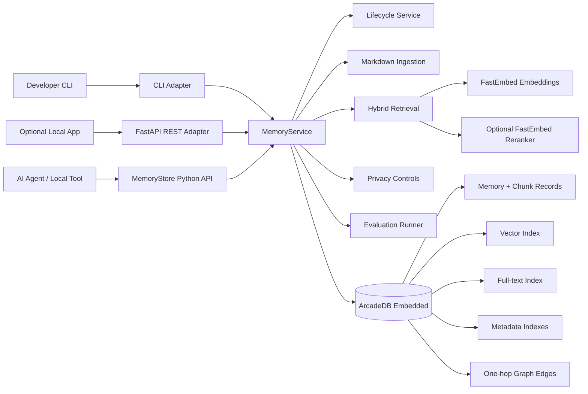

The context boundary is intentionally local. The agent, CLI, optional REST wrapper, FastEmbed models, and ArcadeDB database all run on the same machine or within the same local deployment boundary. This honors the embedded/single-process V1 constraint in `prompt.md §2.1`.

---

## 5. Layered Architecture

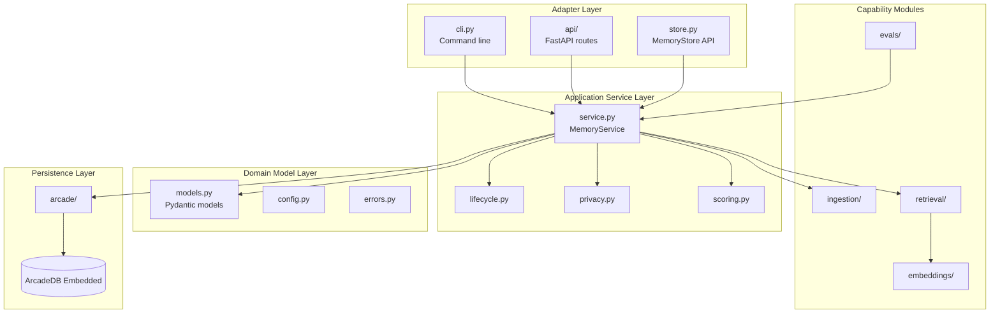

### 5.1 Adapter Layer

The adapter layer exposes system capabilities without owning business logic.

| Adapter | Responsibility | Must Not Do |
|---|---|---|
| `store.py` | Public Python `MemoryStore` facade. | Directly implement persistence internals. |
| `api/` | Optional FastAPI wrapper. | Duplicate lifecycle, retrieval, scoring, or ingestion logic. |
| `cli.py` | Local developer commands. | Bypass the shared service layer. |

Source: `prompt.md §4`, `prompt.md §5`, `prompt.md §14`, `prompt.md §16`.

### 5.2 Application Service Layer

`service.py` is the coordination boundary. It validates inputs, coordinates lifecycle, calls ingestion/retrieval/privacy modules, and delegates persistence to `arcade/`.

Core services:

| Service | Responsibility |
|---|---|
| `MemoryService` | Orchestrates all public operations. |
| `lifecycle.py` | Agent memory lifecycle transitions. |
| `privacy.py` | Forget, delete, disable, export, import, redact. |
| `scoring.py` | Score normalization and final score calculation. |

Source: `prompt.md §4`, `prompt.md §9`, `prompt.md §12`, `prompt.md §13`.

### 5.3 Domain Model Layer

The domain layer contains Pydantic v2 models, enums, configuration, and explicit error types.

Required model groups:

- `Scope`
- `MemoryCreate`
- `MemoryUpdate`
- `MemoryRecord`
- `MemorySearchQuery`
- `MemorySearchResult`
- `MemoryFeedback`
- `IngestResult`
- `FolderIngestResult`
- `MemoryExport`
- `MemoryImport`
- `ImportResult`
- `RedactionResult`
- `MemoryStats`
- `HealthStatus`

Source: `prompt.md §5`, `prompt.md §7`, `prompt.md §13`.

### 5.4 Capability Modules

| Module | Responsibility |
|---|---|
| `ingestion/markdown.py` | Parse Markdown and frontmatter. |
| `ingestion/chunking.py` | Deterministic section/paragraph chunking. |
| `ingestion/hashing.py` | Source hashes, content hashes, deterministic chunk IDs. |
| `retrieval/vector.py` | Vector search against ArcadeDB vector index. |
| `retrieval/full_text.py` | Full-text/BM25 search. |
| `retrieval/fusion.py` | Reciprocal Rank Fusion. |
| `retrieval/rerank.py` | Optional FastEmbed reranking. |
| `retrieval/graph.py` | Optional one-hop graph expansion. |
| `retrieval/filters.py` | Structured filter construction and validation. |
| `embeddings/fastembed_provider.py` | Embedding provider implementation. |
| `embeddings/validation.py` | Embedding model/dimension safety checks. |
| `evals/` | Golden query evaluation and diagnostics. |

Source: `prompt.md §4`, `prompt.md §10`, `prompt.md §11`, `prompt.md §12`, `prompt.md §17`.

### 5.5 Persistence Layer

All ArcadeDB-specific logic belongs in `arcade/`.

| Module | Responsibility |
|---|---|
| `connection.py` | Embedded database lifecycle and connection setup. |
| `schema.py` | Deterministic schema/index creation. |
| `queries.py` | Encapsulated SQL/ArcadeDB query functions. |
| `migrations.py` | Monotonic schema migrations. |
| `transactions.py` | Batch insert/update transaction helpers. |

Source: `prompt.md §4`, `prompt.md §8`, `prompt.md §13.2`.

---

## 6. Package Structure

The implementation should keep the package structure specified in `prompt.md §4`.

```text
memory_store/
  __init__.py
  config.py
  errors.py
  models.py
  store.py
  service.py
  scoring.py
  lifecycle.py
  privacy.py
  cli.py
  ingestion/
  retrieval/
  arcade/
  embeddings/
  api/
  evals/
  tests/
  examples/
  pyproject.toml
  README.md
  config.example.yaml
```

### 6.1 Boundary Rule

Business logic must live in the service and domain modules, not in adapters. REST, CLI, and direct Python calls must converge on the same implementation path.

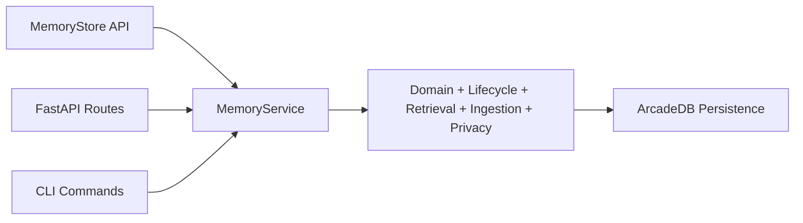

Source: `prompt.md §4`, `prompt.md §14`, `prompt.md §16`.

---

## 7. Public API Architecture

### 7.1 Python API

`MemoryStore` is the public facade for agents and local applications.

Required capability groups:

| Capability | API Examples |
|---|---|
| Configuration | `from_config(...)` |
| Memory CRUD | `add_memory`, `get_memory`, `update_memory`, `upsert_memory` |
| Retrieval | `search` |
| Document ingestion | `ingest_document`, `ingest_folder` |
| Lifecycle | `promote`, `supersede`, `contradict`, `expire`, `forget` |
| Privacy | `forget_by_user`, `delete_by_scope`, `disable_memory`, `redact` |
| Portability | `export_user_memories`, `export_scope`, `import_memories` |
| Feedback | `add_feedback` |
| Operations | `stats`, `health` |

Source: `prompt.md §5`.

### 7.2 API Call Flow

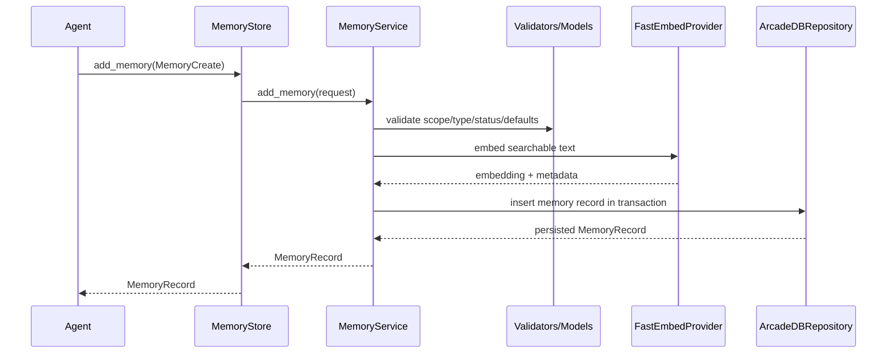

### 7.3 Configuration Precedence

Configuration must resolve in this order:

```text
defaults < config.yaml < environment variables < explicit code arguments
```

Source: `prompt.md §5`, `prompt.md §15`.

---

## 8. Record Families and Lifecycle Architecture

The system has two related but distinct record families.

| Record Family | Examples | Lifecycle Pattern | Retrieval |
|---|---|---|---|
| Agent memory | preferences, project facts, decisions, observations, summaries | Mutable and lifecycle-managed | Shared hybrid retrieval |
| Document chunk | Markdown sections, code blocks, source-controlled docs | Deterministic re-ingestion | Shared hybrid retrieval |

Source: `prompt.md §1`, `prompt.md §9`.

### 8.1 Agent Memory Lifecycle

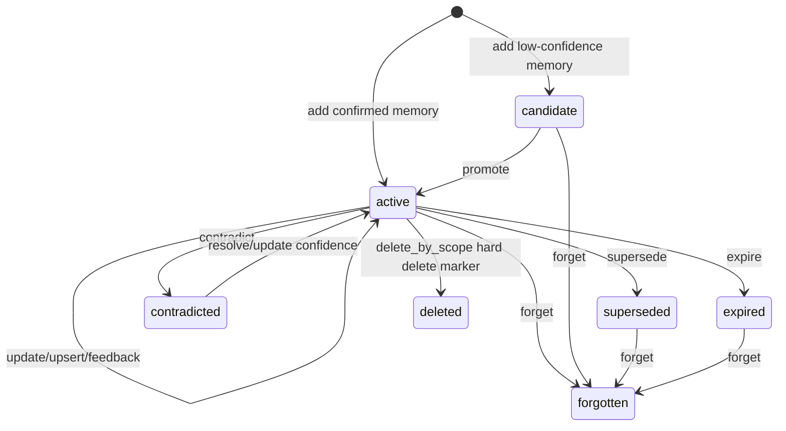

Agent memories support add, upsert, promote, update, supersede, contradict, expire, forget, redact, and feedback operations.

Lifecycle rules:

| Case | Expected Behavior |
|---|---|
| Same fact with newer wording | Update same `stable_key`; increment version. |
| Same fact with more detail | Merge text and preserve prior version metadata. |
| Same fact with changed value | Supersede old memory and create/link new memory. |
| True contradiction | Keep both, link `CONTRADICTS`, lower confidence until resolved. |
| Low-confidence extraction | Store as `observation`, not `project_fact`. |
| User confirmation | Promote confidence and importance. |
| User correction | Supersede old memory immediately. |

Source: `prompt.md §9.1`.

### 8.2 Document Chunk Lifecycle

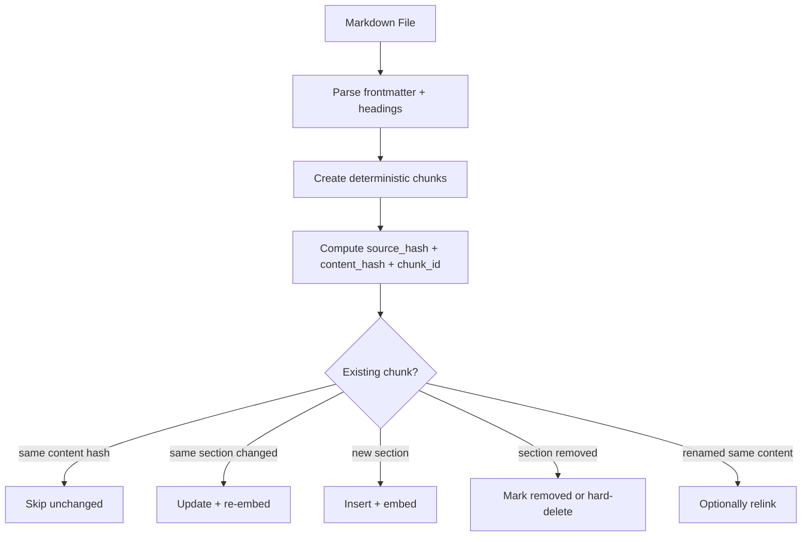

Document chunks are source-controlled. They should not use normal memory supersession unless explicitly converted into an agent memory.

Source: `prompt.md §9.2`, `prompt.md §10`, `prompt.md §21.3`.

---

## 9. Core Data Model Architecture

### 9.1 MemoryRecord Field Groups

`MemoryRecord` should be implemented as a typed Pydantic model with the following field groups.

| Field Group | Purpose | Example Fields |
|---|---|---|
| Identity | Durable record identity and deduplication | `memory_id`, `stable_key`, `version`, `schema_version` |
| Scope | Tenant/project/agent boundaries | `user_id`, `project_id`, `agent_id`, `scope` |
| Classification | Type, status, and sensitivity | `memory_type`, `status`, `sensitivity` |
| Content | Human-readable memory payload | `title`, `summary`, `text`, `tags` |
| Source | Link to document or conversation provenance | `source_type`, `source_path`, `source_hash`, `chunk_id`, `heading_path` |
| Embedding | Vector metadata and validation | `embedding`, `embedding_model`, `embedding_model_version`, `embedding_dim` |
| Scoring Inputs | Ranking quality signals | `confidence`, `importance`, `user_rating` |
| Temporal | Freshness and retention | `created_at`, `updated_at`, `last_accessed_at`, `expires_at` |
| Privacy | Retrieval and LLM-context controls | `allow_retrieval`, `allow_llm_context`, `retention_policy` |
| Lifecycle | Change tracking and relations | `superseded_by`, `metadata` |

Source: `prompt.md §7`.

### 9.2 Status Model

Recommended statuses:

```text
active, candidate, superseded, contradicted, expired, deleted, removed, forgotten
```

Normal retrieval must exclude `forgotten`, `deleted`, and `removed` records unless an explicit audit/debug mode allows otherwise.

Source: `prompt.md §7`, `prompt.md §13.3`.

---

## 10. ArcadeDB Data Architecture

### 10.1 Persistence Responsibilities

ArcadeDB Embedded is the single persistence engine for:

- agent memory records
- source-controlled document chunks
- vector indexes
- full-text indexes
- metadata indexes
- graph relationships
- schema version metadata
- migration history

Source: `prompt.md §1`, `prompt.md §8`.

### 10.2 Recommended Vertex Types

| Vertex Type | Purpose |
|---|---|
| `MemoryRecord` | Unified vertex for agent memories and document chunks. |
| `SchemaVersion` | Stores active schema version and compatibility metadata. |
| `MigrationRecord` | Tracks applied migrations. |
| `RedactionAudit` | Stores safe redaction audit metadata without exposing redacted text. |
| `ImportExportAudit` | Optional audit trail for import/export/delete-by-scope workflows. |

V1 can store both agent memories and document chunks in `MemoryRecord` with `memory_type = document_chunk` for chunks. This reduces schema complexity while preserving separate lifecycle behavior in application logic.

### 10.3 Required Edge Types

| Edge | Meaning | Used By |
|---|---|---|
| `SUPERSEDES` | New memory replaces old memory. | Lifecycle, audit, retrieval debug |
| `CONTRADICTS` | Two records conflict. | Lifecycle, conflict resolution |
| `DERIVED_FROM` | Memory extracted from source document or conversation. | Provenance |
| `RELATED_TO` | Soft relationship between memories. | Graph expansion |
| `SUPPORTS` | One record supports another. | Confidence and context |
| `MENTIONS` | Memory mentions a project/user/entity/topic. | One-hop expansion and filtering |

Source: `prompt.md §8`.

### 10.4 Index Design

| Index Type | Fields | Purpose |
|---|---|---|
| Vector index | `embedding` | Dense semantic retrieval with cosine similarity. |
| Full-text index | `title`, `summary`, `text`, `tags`, `source_path` | Lexical/BM25-style search. |
| Metadata indexes | `memory_type`, `project_id`, `user_id`, `agent_id`, `status`, `created_at`, `stable_key`, `source_hash`, `chunk_id` | Fast filters and deterministic upsert/re-ingest. |

Source: `prompt.md §8`.

### 10.5 Schema Safety

Startup must:

1. Open or create the embedded database.
2. Create schema deterministically if missing.
3. Read stored schema version.
4. Compare against package-supported schema version.
5. Run idempotent migrations if needed.
6. Fail fast on incompatible schema versions.

Source: `prompt.md §13.2`, `prompt.md §21.1`.

---

## 11. Markdown Ingestion Architecture

### 11.1 Ingestion Pipeline

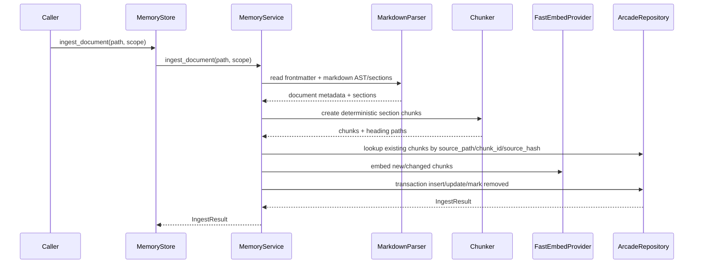

### 11.2 Chunking Rules

Default chunking should use Markdown section or paragraph chunks with heading context. Sentence-level chunking is not the default.

Recommended default configuration:

```yaml
chunking:
  strategy: markdown_section
  max_tokens: 350
  overlap_tokens: 50
  include_heading_path: true
  include_frontmatter_in_embedding: true
  preserve_code_blocks: true
```

`max_tokens` and `overlap_tokens` are approximate whitespace-token budgets, not strict tokenizer-backed limits. Oversized paragraphs and preserved fenced code blocks may exceed the configured budget by design. Persisted chunk metadata should include `approximate_token_count`, the applied chunking settings, and document ordering fields so retrieval clients can reason about chunk size and adjacency.

Source: `prompt.md §10`.

### 11.3 Searchable Embedding Text

When embedding chunks, include structured context instead of embedding only the body text.

```text
Title: <frontmatter name or document title>
Description: <frontmatter description>
Tags: <frontmatter tags>
Section: <heading path>
Content: <chunk content>
```

Source: `prompt.md §10`.

### 11.4 Deterministic Chunk Identity

The deterministic chunk ID must include:

- source path
- heading path
- chunk index
- content hash

This ensures repeatable chunk IDs and makes re-ingestion safe.

Source: `prompt.md §10`, `prompt.md §21.3`.

---

## 12. Retrieval Architecture

### 12.1 Retrieval Flow

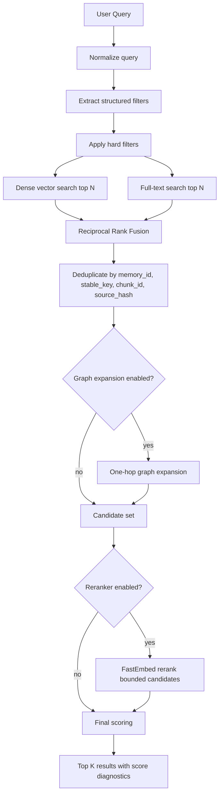

Source: `prompt.md §11`.

### 12.2 Hard Filters

The retrieval layer must apply hard filters before ranking:

- `user_id`
- `project_id`
- `agent_id`
- `memory_type`
- `status = active`
- `source_type`
- `sensitivity`
- `allow_retrieval = true`

Source: `prompt.md §11`.

### 12.3 Fusion Strategy

Vector scores and BM25/full-text scores must not be directly mixed before normalization. First-pass fusion uses Reciprocal Rank Fusion:

```python
rrf_score = 1 / (k + vector_rank) + 1 / (k + fts_rank)
```

Source: `prompt.md §11`.

### 12.4 Graph Expansion

Graph expansion is optional and limited to one hop in V1. Expanded records must be marked in debug metadata and their graph contribution must stay separate from vector and full-text scores.

Source: `prompt.md §11`, `prompt.md §8`.

### 12.5 Result Shape

Each search result must include:

- `memory`
- `final_score`
- `component_scores`
- `normalized_scores`
- `debug`

Source: `prompt.md §7`, `prompt.md §11`, `prompt.md §12`.

---

## 13. Scoring Architecture

### 13.1 Default Scoring Formula

Final scoring is configurable but should ship with these default component weights:

```text
reranker:          0.45
retrieval_fusion:  0.15
vector:            0.10
full_text:         0.08
temporal:          0.07
importance:        0.06
confidence:        0.04
graph:             0.03
user_rating:       0.02
```

Source: `prompt.md §12`.

### 13.2 Score Normalization

Every score component must be normalized before final scoring. Raw values are stored in `component_scores`; normalized values are stored in `normalized_scores`.

Normalization rules should be explicit per component:

| Component | Raw Input | Normalization Recommendation |
|---|---|---|
| `reranker` | FastEmbed reranker score | Min/max or sigmoid over candidate set. |
| `retrieval_fusion` | RRF score | Min/max over fused candidate set. |
| `vector` | Cosine similarity or distance-derived score | Convert to similarity and normalize to 0-1. |
| `full_text` | BM25/full-text score | Min/max over FTS candidate set. |
| `temporal` | Decay function output | Already 0-1. |
| `importance` | Stored record value | Clamp to 0-1. |
| `confidence` | Stored record value | Clamp to 0-1. |
| `graph` | Relationship contribution | Normalize by edge type/neighbor rank. |
| `user_rating` | User feedback value | Map rating scale to 0-1. |

Source: `prompt.md §12`.

### 13.3 Temporal Scoring

Default temporal scoring:

```python
temporal_score = exp(-age_days / half_life_days)
```

Memory type temporal behavior:

| Memory Type | Temporal Behavior |
|---|---|
| `user_preference` | Very slow decay; prefer latest if contradicted. |
| `project_fact` | Moderate decay unless source-controlled. |
| `task_state` | Strong recency boost. |
| `conversation_summary` | Moderate decay. |
| `observation` | Strong decay. |
| `error_debug_note` | Strong decay unless current task references it. |
| `decision` | No decay unless superseded. |
| `document_chunk` | No decay; source version controls freshness. |

Source: `prompt.md §12`.

### 13.4 Reranker Disabled Strategy

If reranking is disabled, redistribute the reranker weight across retrieval components rather than leaving a zero score that unfairly depresses results.

Recommended redistribution:

```text
reranker weight 0.45 redistributed to:
- retrieval_fusion: +0.25
- vector: +0.12
- full_text: +0.08
```

This keeps ranking retrieval-driven while preserving explainability.

Source alignment: `prompt.md §12` requires a documented redistribution strategy.

---

## 14. Privacy and Data Control Architecture

### 14.1 Privacy Rules

| Rule | Expected Behavior |
|---|---|
| `forgotten` records | Not returned by normal retrieval. |
| `deleted` records | Not returned by normal retrieval. |
| `removed` document chunks | Not returned unless audit/debug explicitly requests them. |
| `allow_retrieval = false` | Not returned by search. |
| `allow_llm_context = false` | May be found internally but must not be returned as LLM context. |
| `sensitive` records | Require explicit retrieval permission. |
| Redaction | Preserve audit metadata without exposing redacted text. |
| Scope operations | Export, delete, disable, and redact must support `Scope`. |

Source: `prompt.md §13.3`.

### 14.2 Privacy Operations

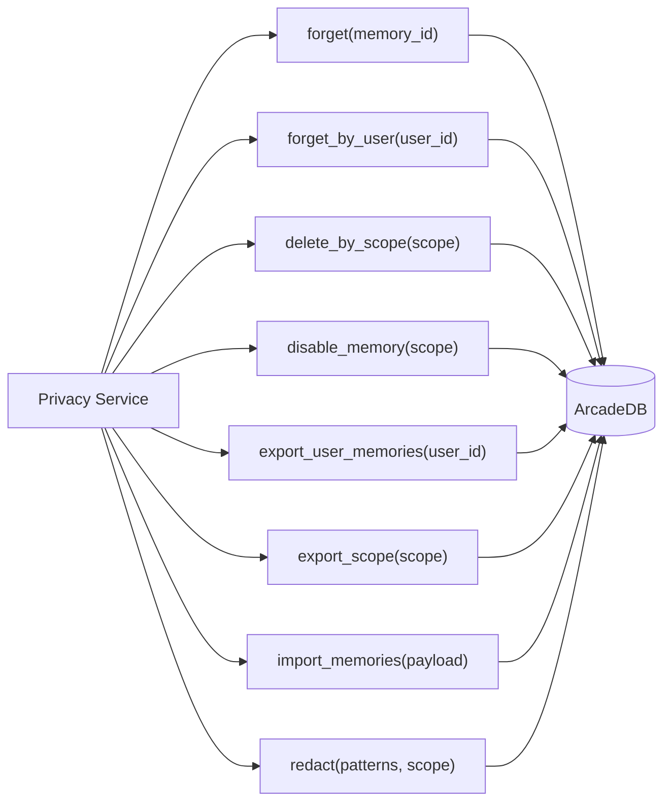


Source: `prompt.md §13.3`.

---

## 15. Operational Safety Architecture

### 15.1 Embedding Safety

Before insert/update, the service must validate:

- embedding dimension matches active index dimension
- embedding model name is stored
- model version or revision is stored when available
- embedding dimension is stored on each record
- model changes have a re-embedding path

Mismatch policy is configurable:

```yaml
dimension_mismatch: error  # error | quarantine | reembed
```

Source: `prompt.md §13.1`, `prompt.md §15`.

### 15.2 Schema Safety

Schema safety includes:

- stored schema version
- migration history
- deterministic schema creation
- idempotent migrations where practical
- startup compatibility validation

Source: `prompt.md §13.2`, `prompt.md §21.1`.

### 15.3 Transaction Safety

Batch ingestion, import, delete-by-scope, and lifecycle transitions should use transactions. A lifecycle transition should never partially update a record without writing related audit metadata and graph edges.

Source: `prompt.md §8`, `prompt.md §13`, `prompt.md §22`.

---

## 16. REST API Architecture

The REST API is optional in V1 and must remain a thin wrapper around the shared service layer.

### 16.1 Required Endpoints

| Method | Endpoint | Service Operation |
|---|---|---|
| `POST` | `/memories` | `add_memory` |
| `GET` | `/memories/{id}` | `get_memory` |
| `PATCH` | `/memories/{id}` | `update_memory` |
| `POST` | `/memories/search` | `search` |
| `POST` | `/chunks/search` | `search_document_chunks` |
| `GET` | `/chunks/{chunk_id}` | `get_chunk` |
| `GET` | `/chunks/{chunk_id}/context` | `get_chunk_context` |
| `POST` | `/documents/ingest` | `ingest_document` |
| `POST` | `/documents/ingest-folder` | `ingest_folder` |
| `POST` | `/memories/{id}/feedback` | `add_feedback` |
| `POST` | `/memories/{id}/forget` | `forget` |
| `POST` | `/memories/export` | `export_scope` or `export_user_memories` |
| `POST` | `/memories/import` | `import_memories` |
| `POST` | `/memories/delete-by-scope` | `delete_by_scope` |
| `GET` | `/health` | `health` |
| `GET` | `/stats` | `stats` |

Source: `prompt.md §14`.

### 16.2 REST Error Mapping

| Error Type | HTTP Status | Example |
|---|---:|---|
| Validation error | 422 | Invalid memory type or scope. |
| Not found | 404 | Memory ID not found. |
| Conflict | 409 | Schema mismatch or duplicate stable key conflict. |
| Embedding mismatch | 422 or 409 | Embedding dimension does not match active index. |
| Privacy violation | 403 | Sensitive record requested without explicit permission. |
| Internal persistence error | 500 | ArcadeDB failure. |

Source: `prompt.md §14`, `prompt.md §13`.

---

## 17. CLI Architecture

The CLI supports local workflows and mass ingestion without bypassing service logic.

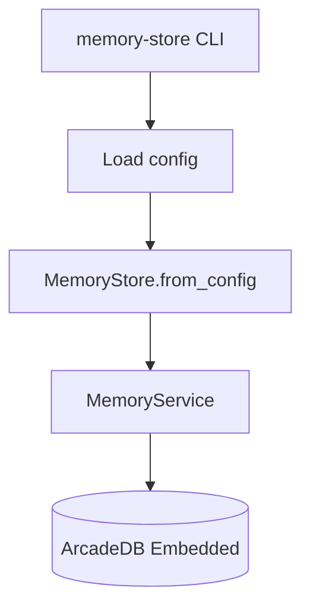

Example command groups:

| Command | Purpose |
|---|---|
| `init` | Initialize database/schema. |
| `ingest-file` | Ingest one Markdown file. |
| `ingest-folder` | Batch ingest Markdown folder. |
| `search` | Search memories/chunks. |
| `search-chunks` | Search only document chunks and return chunk-oriented payloads. |
| `chunk-context` | Fetch surrounding chunks by stable chunk ID. |
| `eval` | Run golden query evaluation. |
| `export` | Export user/scope memories. |
| `delete-by-scope --dry-run` | Preview scoped deletion. |

Source: `prompt.md §16`.

---

## 18. Configuration Architecture

`config.example.yaml` must cover database, embeddings, reranker, retrieval, scoring, chunking, privacy, API, and logging.

### 18.1 Configuration Sections

| Section | Controls |
|---|---|
| `database` | path, schema version, embedded mode. |
| `embeddings` | provider, model, dimension, batch size, mismatch policy. |
| `reranker` | enabled flag, provider, model, candidate count. |
| `retrieval` | vector top N, FTS top N, RRF k, graph expansion, final top K. |
| `scoring` | component weights and temporal behavior. |
| `chunking` | strategy, max tokens, overlap, heading/frontmatter options. |
| `privacy` | sensitivity defaults and delete confirmation behavior. |
| `api` | host, port, token, enabled flag. |
| `logging` | log level. |

Source: `prompt.md §15`.

### 18.2 Runtime Configuration Flow


Source: `prompt.md §5`, `prompt.md §15`.

---

## 19. Evaluation Architecture

The evaluation suite validates retrieval quality, scoring diagnostics, ingestion quality, and lifecycle freshness.

### 19.1 Eval Flow

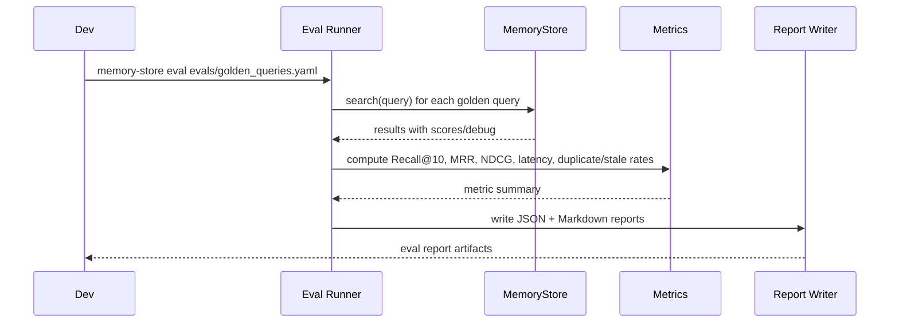

Source: `prompt.md §17`.

### 19.2 Required Metrics

| Metric | Purpose |
|---|---|
| Recall@10 | Confirms expected memory appears in top 10. |
| MRR | Confirms expected memory ranks near the top. |
| NDCG | Measures ranking quality. |
| Latency p50/p95 | Tracks agent usability. |
| Reranker cost/time | Keeps reranking bounded. |
| Duplicate rate | Measures ingestion quality. |
| Stale memory rate | Measures lifecycle quality. |

Source: `prompt.md §17`.

---

## 20. Testing Architecture

Testing must be deterministic and local.

### 20.1 Test Layers

| Test Layer | Coverage |
|---|---|
| Unit tests | Models, config, hashing, chunking, score normalization, RRF. |
| Integration tests | ArcadeDB schema, migrations, CRUD, ingestion, retrieval. |
| Lifecycle tests | Promote, supersede, contradict, expire, forget, feedback. |
| Privacy tests | Export, import, delete-by-scope, redact, disable. |
| API tests | Route validation and service-layer parity. |
| Eval tests | Golden query fixture returns expected memories. |

Source: `prompt.md §18`, `prompt.md §21`.

### 20.2 Required Determinism Tests

The highest-priority tests are:

1. re-ingesting the same file twice skips unchanged chunks
2. deterministic chunk IDs remain stable
3. changed chunks are updated and re-embedded
4. removed chunks are marked removed or deleted according to config
5. hybrid retrieval returns expected golden memories
6. REST routes call the shared service layer

Source: `prompt.md §18`, `prompt.md §21.3`, `prompt.md §21.4`, `prompt.md §21.5`.

---

## 21. Implementation Milestones

### Milestone 1: Package Skeleton and Configuration

Deliverables:

- package structure
- `pyproject.toml`
- Pydantic settings/config models
- error types
- README stub
- `config.example.yaml`

Acceptance checks:

- package imports locally
- config precedence works
- static typing and linting pass baseline

Source: `prompt.md §3`, `prompt.md §4`, `prompt.md §15`.

### Milestone 2: ArcadeDB Schema and Repository

Deliverables:

- embedded connection manager
- deterministic schema creation
- memory vertex schema
- indexes
- edge types
- migration metadata
- repository CRUD methods

Acceptance checks:

- database initializes locally
- schema version validates at startup
- migrations are idempotent

Source: `prompt.md §8`, `prompt.md §13.2`, `prompt.md §21.1`.

### Milestone 3: MemoryStore API and Service Layer

Deliverables:

- `MemoryStore` facade
- `MemoryService`
- add/get/update/upsert/search placeholders
- core Pydantic models

Acceptance checks:

- memory can be added and retrieved
- REST/CLI are not yet required

Source: `prompt.md §5`, `prompt.md §7`.

### Milestone 4: Embeddings and Safety

Deliverables:

- FastEmbed provider
- searchable text builder
- embedding dimension validation
- model/version/dimension metadata storage
- mismatch policy handling

Acceptance checks:

- invalid dimensions are rejected or quarantined according to config
- model metadata is stored with each embedded record

Source: `prompt.md §3`, `prompt.md §13.1`.

### Milestone 5: Markdown Ingestion

Deliverables:

- frontmatter parser
- section chunker
- deterministic hash/chunk ID logic
- source re-ingestion comparison
- insert/update/skip/remove behavior

Acceptance checks:

- unchanged re-ingestion skips chunks
- changed chunks update and re-embed
- removed chunks follow configured policy

Source: `prompt.md §10`, `prompt.md §21.3`.

### Milestone 6: Hybrid Retrieval

Deliverables:

- vector search
- full-text search
- RRF fusion
- deduplication
- optional one-hop graph expansion
- optional reranker
- result debug metadata

Acceptance checks:

- hybrid retrieval returns expected golden memories
- vector and BM25 scores are not directly mixed before fusion

Source: `prompt.md §11`, `prompt.md §17`, `prompt.md §21.4`.

### Milestone 7: Scoring

Deliverables:

- component normalization
- configurable weights
- per-memory-type temporal behavior
- reranker-disabled redistribution strategy
- final result diagnostics

Acceptance checks:

- search results include final, raw, normalized, and debug scores
- unavailable components do not produce misleading scores

Source: `prompt.md §12`, `prompt.md §21.4`.

### Milestone 8: Lifecycle and Privacy

Deliverables:

- promote/supersede/contradict/expire/forget
- feedback
- export/import
- delete-by-scope
- disable-by-scope
- redact
- audit metadata

Acceptance checks:

- forgotten/deleted memories are not retrievable
- user feedback updates scoring inputs
- export/import/delete controls work

Source: `prompt.md §9`, `prompt.md §13`, `prompt.md §21.2`, `prompt.md §21.6`.

### Milestone 9: REST, CLI, Evals, and Documentation

Deliverables:

- FastAPI routes
- CLI commands
- golden query eval runner
- JSON and Markdown eval reports
- complete README examples

Acceptance checks:

- REST routes use same service layer
- evals run locally
- README examples are runnable

Source: `prompt.md §14`, `prompt.md §16`, `prompt.md §17`, `prompt.md §19`, `prompt.md §21.5`.

---

## 22. Key Architecture Decisions

### ADR-001: Use ArcadeDB Embedded as the Only Persistence Engine

**Decision:** Store memory records, chunks, vectors, full-text indexes, metadata indexes, and graph edges in ArcadeDB Embedded.

**Rationale:** V1 favors local reliability, deterministic behavior, and simple deployment over distributed complexity.

**Consequences:** The system remains portable and local-first, but V1 does not support multi-writer distributed workloads.

Source: `prompt.md §1`, `prompt.md §2`, `prompt.md §8`.

### ADR-002: Make `MemoryStore` the Primary API

**Decision:** The Python API is the primary interface. REST and CLI are wrappers.

**Rationale:** AI agents and local Python tools can call the package directly with less operational overhead.

**Consequences:** REST must remain thin and cannot diverge from Python behavior.

Source: `prompt.md §5`, `prompt.md §14`.

### ADR-003: Use Separate Lifecycle Rules for Agent Memories and Document Chunks

**Decision:** Agent memories use lifecycle transitions; document chunks use deterministic re-ingestion.

**Rationale:** Agent memories are mutable knowledge. Document chunks are source-controlled artifacts.

**Consequences:** Retrieval can be shared, but lifecycle code must branch by record family.

Source: `prompt.md §1`, `prompt.md §9`.

### ADR-004: Use RRF Before Final Scoring

**Decision:** Fuse vector and full-text results with Reciprocal Rank Fusion before reranking/final scoring.

**Rationale:** Raw vector and BM25 scores are not directly comparable.

**Consequences:** Retrieval diagnostics must preserve vector rank, FTS rank, RRF score, and final score separately.

Source: `prompt.md §11`, `prompt.md §12`.

### ADR-005: Keep Graph Expansion to One Hop in V1

**Decision:** Optional graph expansion is limited to one hop.

**Rationale:** One-hop expansion provides useful context while avoiding ontology and traversal complexity.

**Consequences:** Multi-hop reasoning is explicitly deferred.

Source: `prompt.md §2`, `prompt.md §8`, `prompt.md §11`.

---

## 23. Risks and Mitigations

| Risk | Impact | Mitigation | Prompt Reference |
|---|---|---|---|
| Embedding dimension mismatch | Vector index corruption or failed search | Validate dimensions before insert/update; store model metadata. | `prompt.md §13.1` |
| REST logic drift | Python and REST behavior diverge | REST routes call shared service layer only. | `prompt.md §14`, `prompt.md §21.5` |
| Stale memories | Agent uses outdated facts | Status lifecycle, temporal scoring, supersession, eval stale-rate metric. | `prompt.md §9`, `prompt.md §12`, `prompt.md §17` |
| Duplicate chunks | Retrieval clutter and score dilution | Deterministic chunk IDs and source hashes. | `prompt.md §10`, `prompt.md §18` |
| Hidden scoring behavior | Hard to debug retrieval | Store raw and normalized component scores plus debug metadata. | `prompt.md §12` |
| Privacy leakage | Sensitive or forgotten records returned | Hard filters, `allow_llm_context`, `sensitivity`, and status rules. | `prompt.md §13.3` |
| Overbuilt V1 | Slow implementation and fragile architecture | Enforce V1 non-goals and simple module boundaries. | `prompt.md §2`, `prompt.md §20` |

---

## 24. Acceptance Checklist

### Package and Database

- [ ] Package installs locally with Python 3.12+.
- [ ] ArcadeDB Embedded initializes from Python.
- [ ] Schema is created deterministically.
- [ ] Stored schema version is validated at startup.
- [ ] Migrations run idempotently.

### Agent Memory Lifecycle

- [ ] Memory can be added, retrieved, updated, promoted, superseded, contradicted, expired, forgotten, and exported.
- [ ] Feedback updates confidence, importance, or user rating.
- [ ] Forgotten/deleted memories are not returned by normal retrieval.

### Document Ingestion Lifecycle

- [ ] Markdown documents ingest deterministically.
- [ ] Chunk IDs are generated from source path, heading path, chunk index, and content hash.
- [ ] Unchanged re-ingestion skips chunks.
- [ ] Changed chunks update and re-embed.
- [ ] New chunks insert.
- [ ] Removed chunks are deleted or marked removed based on config.

### Retrieval and Scoring

- [ ] Hybrid retrieval performs vector search + full-text search + RRF.
- [ ] Optional reranking works on a bounded candidate set.
- [ ] Final scoring is configurable.
- [ ] Search results include final score, raw component scores, normalized scores, and debug metadata.
- [ ] Per-memory-type temporal behavior is configurable.
- [ ] Golden query eval fixture passes.

### REST/API Parity

- [ ] REST routes call the same service layer as the direct Python API.
- [ ] REST route handlers do not duplicate retrieval, lifecycle, scoring, or ingestion logic.
- [ ] REST examples are runnable.

### Operational Safety

- [ ] Embedding dimensions are validated before insert/update.
- [ ] Embedding model, version/revision, and dimensions are stored.
- [ ] Import/export/delete-by-scope privacy controls work.
- [ ] Evals run locally and produce a Markdown report.
- [ ] README examples are runnable.

Source: `prompt.md §21`.

---

## 25. Summary Architecture Statement

Build the system as a small, local-first Python package where `MemoryStore` is the stable public API, `MemoryService` is the shared orchestration layer, ArcadeDB Embedded is the single persistence engine, FastEmbed supplies local embeddings and optional reranking, and retrieval is an explainable hybrid pipeline using vector search, full-text search, RRF, optional one-hop graph expansion, optional reranking, and configurable final scoring.

The strongest implementation guardrail is lifecycle separation: agent memories are mutable and lifecycle-managed, while document chunks are source-controlled and updated through deterministic re-ingestion. This keeps the system reliable, inspectable, and lightweight for V1 while leaving room for future distributed features outside the V1 boundary.
