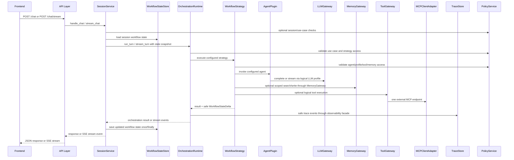

# Training README: Pluggable Agentic AI Backend

**Audience:** Developers, engineers, AI platform builders, backend engineers, integration engineers, DevOps teams, support engineers, business operations teams, and technical leads.  
**Purpose:** Provide one practical training guide for understanding the implemented backend capabilities, runtime boundaries, concepts, decision criteria, and example use cases without reading every architecture or implementation-plan document first.  
**Implementation basis:** This version is updated from the implementation plan documents used to write the backend code. It reflects the implemented backend slices through policy, agents, workflow strategies, orchestration, tooling/MCP, memory, LLM, session, API, persistence, observability, configuration, contracts, and foundation work. Deployment is partially implemented and is called out separately.

---

## 1. Executive Summary

The pluggable agentic AI backend is a modular Python backend for building AI applications that need more than a single prompt-response chatbot. It provides a configurable runtime where a frontend can send chat or task requests, the backend can preserve session state, route the request through orchestration, select a workflow strategy, invoke task-specific agents, call LLMs, search memory, execute tools through MCP, record safe traces, and enforce policy controls.

The backend is intended for real-world operational use cases such as:

- DevOps support assistants that can answer questions from runbooks, inspect safe logs or deployment state through approved tools, summarize incidents, and generate remediation plans.
- Stock-plan services department assistants that can help business teams search policies, summarize participant cases, draft communications, validate operational procedures, and perform approved business activities through controlled internal tools.
- Project and engineering assistants that can answer architecture questions, search documents, review code or generated artifacts, and remember durable project decisions.

The core design principle is:

> **The frontend owns user experience. The backend owns orchestration. The MCP server owns external tool exposure.**

The second core rule is:

> **Agents and strategies do not directly import provider SDKs, MCP clients, SQLite clients, ArcadeDB clients, `memory_store`, or external API clients. They receive controlled capabilities through backend gateways and orchestration context.**

The backend is built around stable boundaries:

```text
API -> SessionService -> OrchestrationRuntime -> WorkflowStrategy -> AgentPlugin
                                                -> LLMGateway
                                                -> MemoryGateway
                                                -> ToolGateway -> MCPClientAdapter -> MCP Server
```

This lets teams add new use cases, agents, strategies, LLM profiles, tools, and memory behavior through configuration, contracts, registries, and adapters instead of rewriting API routes or embedding infrastructure directly inside agents.

---

## 2. Implementation Status Snapshot

The training README originally summarized the architecture. The attached implementation plans show what was actually built. The following status reflects those plan documents.

| Area | Status Reflected in This README | Notes |
|---|---|---|
| Backend foundation | Implemented | Backend is rooted under `backend/`, with import-safe FastAPI app factory, baseline settings, health/capabilities, logging, trace IDs, and safe errors. |
| Core contracts | Implemented | Provider-neutral contracts exist for context, results, errors, health, agents, strategies, LLM, memory, tools, state, trace, policy, and config, with fakes for tests. |
| Configuration | Implemented | Runtime config is backend-rooted under `backend/config/`, validated, redacted, environment-aware, and exposed through typed views. |
| Observability | Implemented | Request trace IDs, structured logging, redaction, trace recorder, health aggregation, metrics stub, and safe trace persistence integration are implemented. |
| Persistence | Implemented | Persistence bundle builds workflow-state, trace, and memory boundaries through typed settings and safe startup health. |
| SQLite workflow state | Implemented | Version-aware SQLite workflow-state store supports load/save/reset, reset metadata, guardrails, health, and concurrency baseline. |
| SQLite trace store | Implemented | Append-first trace store supports run/event/retention model, batch writes, safe reads/searches, health, retention, and redacted payloads. |
| API layer | Implemented | Thin FastAPI routes support chat, streaming, reset, health, capabilities, and optional debug-trace access behind guards. |
| Session service | Implemented | Session service owns session lifecycle, request mapping, workflow-state handoff, streaming finalization, history, reset, and concurrency behavior. |
| LLM gateway | Implemented | Provider-neutral LLM gateway supports profiles, providers, OpenAI-compatible local/custom endpoints, streaming, retries, fallbacks, health, policy, and tracing. |
| Memory adapter | Implemented | Dedicated memory runtime wraps the installed `memory_store` package and ArcadeDB-backed memory without leaking wrapper details upward. |
| Tooling and MCP client | Implemented | Tool gateway, registry, discovery, schema validation, result normalization, policy hooks, HTTP MCP transport, auth, retry, cancellation, and one MCP endpoint are implemented. |
| Orchestration runtime | Implemented | Runtime supports typed orchestration settings, state deltas, strategy registry, use-case routing, health/capabilities, streaming normalization, and safe runtime limits. |
| Workflow strategies | Implemented | V1 strategy catalog includes `direct_agent`, `retrieval_augmented`, `tool_assisted`, `router`, `fallback_answer`, `memory_update`, and disabled-by-default `bounded_planner`. |
| Agents | Implemented | Dedicated agent runtime includes structured agent models, registry/factory, general assistant, document Q&A, tool-using, project, memory curator, and reviewer agents. |
| Policy | Implemented | Deny-by-default policy, typed decisions, evaluators, gateway hardening, approvals, fallback/exposure controls, audit summaries, and decision cache are implemented. |
| Deployment | Partially implemented | Backend-rooted environment contract, runtime paths, startup validation, and safe startup summaries are implemented. Full readiness diagnostics, smoke scripts, packaging/host assets, backup/restore, rollback, and CI/CD deployment gates are still follow-on work. |

The most important correction from the implementation plans is that deployment should not be presented as fully complete. The runtime backend is implemented through policy; deployment hardening is only complete through startup/path validation.

---

## 3. What Problems This Backend Helps Solve

This backend solves problems that appear when AI systems move from demos to operational workflows.

| Problem | How the Backend Helps |
|---|---|
| Multiple AI behaviors are needed in one backend | Use cases select strategies, agents, memory, tools, and policy profiles through configuration. |
| Different tasks need different LLMs | Logical LLM profiles allow the orchestrator, router, agents, reviewers, or tools flows to use different models/providers. |
| Local and cloud model support are both required | The LLM gateway hides OpenAI-compatible local/custom endpoints, OpenAI, Google, and future provider adapters. |
| Teams need document Q&A or RAG | Memory gateway retrieves bounded long-term memory and document chunks instead of returning entire documents by default. |
| Teams need safe tool execution | Tool gateway validates logical tools and calls a single MCP endpoint through a backend MCP adapter. |
| Business processes require guardrails | Policy denies by default, gates sensitive scopes/actions, supports approval-required decisions, and keeps gateways as final enforcement points. |
| Users need session continuity | Session service loads, updates, and resets short-term workflow state without deleting long-term memory or traces. |
| Operators need debugging | Trace store captures safe request timelines, event summaries, errors, and durations without storing raw prompts, raw completions, secrets, or raw tool payloads by default. |
| Teams need testability | Fakes exist for state, trace, memory, tools, LLM, policy, agents, and orchestration. |
| Teams need modular ownership | Frontend, backend runtime, MCP server, memory, LLM, policy, agents, and workflows can be evolved independently behind contracts. |

---

## 4. Three-Tier System Overview

V1 uses three deployable application pieces:

```text
Frontend
   |
   | REST / SSE
   v
Backend Application
   |
   | MCP protocol through backend MCP client adapter
   v
Single MCP Server
```

### 4.1 Tier Responsibilities

| Tier | Owns | Does Not Own |
|---|---|---|
| Frontend | Chat UI, user experience, REST calls, SSE rendering, session display, reset button, optional upload/attachment handoff | Agent routing, LLM calls, MCP protocol, memory retrieval, workflow logic, policy enforcement |
| Backend application | API, session service, orchestration runtime, workflow strategies, agents, gateways, policy, config, observability, persistence adapters | Frontend UI, MCP server implementation, raw external API integrations inside agents |
| Single MCP server | Tool schemas, tool execution, downstream business/API integration, MCP protocol server behavior | Backend orchestration, sessions, workflow-state persistence, frontend UX |

### 4.2 Backend Internal Module Map

The implementation plans consistently keep backend runtime code under `backend/`:

```text
backend/
  app/
    api/
    session/
    orchestration/
    orchestration/strategies/
    agents/
    llm/
    memory/
    tools/
    tools/mcp/
    persistence/
    policy/
    observability/
    config/
    contracts/
    foundation/
    deployment/        # partially implemented deployment/runtime validation helpers
    testing/fakes/
  config/
  data/
  tests/
  scripts/             # deployment scripts planned/follow-on where applicable
  deploy/              # deployment assets planned/follow-on where applicable
```

Backend code should not be placed in the repository root, `frontend/`, or `mcp/`. The top-level `mcp/` folder is a separate deployable concern, not part of the backend runtime package.

### 4.3 Runtime Flow



---

## 5. Implemented Capabilities

### 5.1 API and Frontend Integration

The API layer is intentionally thin. It validates inbound requests, attaches request metadata and trace IDs, delegates to `SessionService`, and maps service results to HTTP or SSE responses.

Implemented and planned-safe route surface:

| Route | Purpose | Implementation Notes |
|---|---|---|
| `POST /chat` | Non-streaming chat/task request | Delegates to session service. |
| `POST /chat/stream` | Streaming chat/task request over SSE | Emits normalized SSE events; state is finalized once. |
| `POST /sessions/{session_id}/reset` | Reset short-term workflow/session state | Clears workflow state only. |
| `GET /health` | Aggregated backend health summary | Exists; deployment-specific readiness semantics are still follow-on hardening. |
| `GET /capabilities` | Safe frontend feature discovery | Shows enabled use cases/features without leaking sensitive config. |
| `GET /debug/traces/{trace_id}` | Optional protected trace debug route | Disabled by default / guarded. |
| `GET /debug/traces` | Optional protected recent trace search | Disabled by default / guarded. |

API routes must not run SQL, call LLMs, execute tools, call MCP, read raw memory stores, or coordinate workflow strategy logic.

### 5.2 Session Service

The session layer owns the conversation/runtime lifecycle but not model/tool/memory behavior.

Implemented session capabilities include:

- Session ID creation, validation, and create/resume behavior.
- Dedicated top-level `session` configuration.
- Session-owned DTOs, identifiers, error boundary, and mapping helpers.
- Workflow-state load/save/reset handoff.
- Version-aware workflow-state persistence integration.
- Non-streaming and streaming turn handling.
- Streaming finalization once, with optimistic conflict behavior.
- Optional history projection when configured.
- Session health and capability surfacing.
- Reset that clears workflow state only.

Session reset does **not** delete long-term memory, document chunks, trace events, LLM profiles, MCP configuration, policy configuration, or other sessions.

### 5.3 Orchestration Runtime

The orchestration runtime owns one user turn. It chooses how work should happen, not what every domain-specific response should say.

Implemented orchestration capabilities include:

- Canonical top-level `orchestration` settings.
- Use-case routing.
- Strategy registry and strategy factory behavior.
- Configured agent lookup.
- `run_turn` and `stream_turn` style runtime behavior.
- Safe workflow-state delta output.
- Streaming event normalization.
- Runtime limits and cancellation behavior.
- Health and capability summaries.
- No direct SQLite, MCP protocol, provider SDK, or raw memory wrapper access from orchestration modules.

### 5.4 Workflow Strategies

Strategies define the shape of a turn. They decide whether to answer directly, retrieve memory first, call tools, route among agents, update memory, or produce a fallback.

Implemented V1 strategy catalog:

| Strategy | Purpose | Typical Use | Memory | Tools | Planner |
|---|---|---|---:|---:|---:|
| `direct_agent` | Simple agent answer | General assistant, simple support response | Optional/off | No | No |
| `retrieval_augmented` | Retrieve memory/docs before answer | Document Q&A, SOP assistant, architecture Q&A | Yes | No by default | No |
| `tool_assisted` | Execute allowed tools when needed | DevOps triage, business lookup, ticket/task creation | Optional | Yes | Limited loop |
| `router` | Choose among configured strategies/agents | Multi-use-case assistant | Optional | Optional | No |
| `fallback_answer` | Safe fallback response | Degraded mode, policy denial, unavailable services | No | No | No |
| `memory_update` | Extract and write memory candidates | Durable project decisions, curated business knowledge | Write-capable | No | No |
| `bounded_planner` | Plan and execute a small bounded sequence | Carefully controlled multi-step workflows | Optional | Optional | Yes, disabled by default |

The implementation plans harden the strategy layer with context budgets, prompt-input helpers, tool intents, memory intents, fallback behavior, stream mapping, trace helpers, and strict planner validation.

### 5.5 Agent Plugins

Agents provide task-specific intelligence. Strategies decide the workflow; agents perform task-specific answer/review/extraction behavior.

Implemented V1 agent types:

| Agent Type | Purpose | Example |
|---|---|---|
| `general_assistant` | General answers through LLM gateway | “Explain what this service does.” |
| `document_qa` | Answers from bounded retrieved context | “What does the runbook say about rolling back?” |
| `tool_using` | Produces logical tool intents and final answers from safe tool results | “Check deployment status and summarize.” |
| `project_agent` | Project-scoped assistant for files, docs, tools, and architecture | “Find where trace persistence is implemented.” |
| `memory_curator` | Extracts durable memory candidates | “Remember this project decision if policy allows.” |
| `reviewer` | Reviews generated answers, plans, artifacts, or risky steps | “Review this incident summary for completeness.” |

Agents may call LLMs through `LLMGateway`, memory through `MemoryGateway`, and tools through `ToolGateway` only when their contract and policy allow it. Agents must not persist workflow state directly.

### 5.6 LLM Gateway

The LLM gateway provides provider-neutral model access through logical profiles.

Implemented LLM capabilities include:

- Typed `llm` configuration with providers, profiles, defaults, capabilities, and allowlists.
- Provider registry and profile resolver.
- Default gateway with policy hook, redaction, tracing, retry, and fallback.
- Structured output support.
- Streaming lifecycle events.
- OpenAI-compatible adapter for local/custom `/v1/chat/completions` endpoints.
- Optional provider scaffolds for future providers.
- Health and profile listing.
- API error mapping for normalized LLM failures.

Strategies and agents ask for a logical profile such as `default_reasoning`, `local_reasoning`, `tool_reasoning`, or `reviewer_lightweight`. They do not hard-code provider URLs or instantiate provider SDKs.

### 5.7 Memory Gateway

The memory layer provides durable knowledge and document retrieval through the existing `memory_store` wrapper backed by ArcadeDB.

Implemented memory capabilities include:

- Dedicated `backend/app/memory/` runtime package.
- Provider-neutral memory contract for search, get, lifecycle, ingestion, privacy, health, and stats.
- Adapter around installed `memory_store` wrapper without leaking wrapper types upward.
- Memory search with bounded results and safe snippets.
- Document ingestion and chunk retrieval.
- Bounded prompt-context construction.
- Lifecycle operations such as promote, supersede, contradict, expire, and forget.
- Privacy/admin operations such as delete/export by scope.
- Policy-gated writes and scope checks.
- Safe health/capability exposure.

Important behavior:

> Search should return relevant memory records or document chunks, not entire documents by default.

### 5.8 Tool Gateway and MCP Client

The tooling layer provides controlled external action through one backend-owned `ToolGateway` and one MCP client adapter.

Implemented tooling/MCP capabilities include:

- Typed tooling and MCP settings.
- Provider-neutral tool contracts with scopes, streaming, health, capabilities, and normalized errors.
- Dedicated runtime package under `backend/app/tools/` and `backend/app/tools/mcp/`.
- Logical tool registry.
- Tool discovery from MCP and allowlist merging.
- Schema validation and argument bounds.
- Secret-like argument detection and redaction.
- Bounded result normalization and safe summaries.
- Policy hooks, approval readiness, and denial behavior.
- HTTP MCP transport.
- Authentication, timeout, retry, and cancellation behavior.
- Health, capabilities, and API error mapping.

V1 keeps **one configured MCP endpoint**. The backend should not expose or depend on two MCP endpoints unless a later architecture explicitly changes that.

### 5.9 Persistence

V1 separates persistence into three different domains:

| Domain | Purpose | Contract | Adapter | Storage Engine |
|---|---|---|---|---|
| Short-term workflow/session state | Current session state, safe history summary, checkpoints, reset metadata | `WorkflowStateStore` | `SqliteWorkflowStateStore` | SQLite |
| Operational traces | Request/event diagnostics and debug-safe summaries | `TraceStore` | `SqliteTraceStore` | SQLite |
| Long-term memory and document chunks | Durable knowledge and searchable context | `MemoryGateway` | `MemoryStoreAdapter` | `memory_store` -> ArcadeDB |

These stores are not interchangeable:

- Workflow state is not long-term memory.
- Trace events are not memory.
- Memory is not a session checkpoint.
- Session reset clears workflow state only.
- Trace retention cleanup must never delete workflow state, memory, ArcadeDB content, policy config, LLM config, or MCP config.

### 5.10 Observability

Implemented observability capabilities include:

- Request trace ID generation and validation.
- Trace ID propagation through middleware and response headers.
- Structured logging.
- Configuration-driven observability behavior.
- Shared redaction rules.
- Trace recorder.
- SQLite trace store integration.
- Health aggregation.
- Metrics stub.
- Startup/request/error integration.

Logs, traces, health responses, and errors must not expose secrets, authorization headers, cookies, JWTs, provider credentials, connection strings, raw prompts, raw completions, raw workflow state, raw memory records, raw tool payloads, raw MCP responses, hidden scratchpads, or full stack traces by default.

### 5.11 Policy and Guardrails

Policy is implemented as a cross-cutting runtime layer. It does not execute actions. It decides whether actions are allowed, denied, or approval-required.

Implemented policy capabilities include:

- Provider-neutral policy contracts.
- Normalized decisions and reason codes.
- Typed policy settings.
- Policy-owned composition root under `backend/app/policy/`.
- Domain evaluators for session, use case, strategy, agent, LLM, memory, tools, trace, stream, health, and capabilities.
- Gateway hardening for LLM, memory, and tools.
- Approval-required behavior.
- Fallback hardening after denials or side effects.
- Trace, stream, redaction, capability, and health exposure controls.
- Safe audit summaries.
- Per-turn decision cache.
- Dedicated policy tests.

Core policy rule:

> Deny by default. Fail closed for sensitive operations when policy configuration is invalid or policy evaluation cannot complete safely.

### 5.12 Configuration

Configuration is YAML-driven and environment-aware. Runtime code consumes typed configuration views instead of reading raw YAML directly.

Configuration controls:

- Active/default use case.
- Use-case definitions.
- Strategy catalog and defaults.
- Agent definitions and capabilities.
- LLM providers and logical profiles.
- Memory retrieval, ingestion, lifecycle, privacy, and health settings.
- Tool/MCP registry, discovery, auth, timeouts, and allowlists.
- SQLite workflow-state and trace-store settings.
- API/session behavior.
- Policy profiles and exposure controls.
- Observability and health behavior.
- Deployment/runtime path settings.

Secrets must be provided through environment variables or secret managers, not committed YAML.

---

## 6. Core Concepts and How They Differ

### 6.1 Concept Cheat Sheet

| Concept | Plain-English Meaning | Owns | Does Not Own |
|---|---|---|---|
| Use case | A configured product/business behavior such as `devops_support` or `stock_plan_case_assistant`. | Strategy selection, allowed agents, policy profile, allowed memory/tool behavior, orchestrator profile. | Runtime execution by itself. |
| Session | A user's short-term conversation/runtime continuity. | Session ID, create/resume, safe history projection, workflow-state handoff, reset. | Long-term memory deletion, LLM/tool execution. |
| Workflow | The multi-step shape of a turn/task. | Step ordering, state deltas, checkpoints, summaries. | Provider SDKs, DB internals, MCP protocol. |
| Workflow state | Short-term persisted session state. | Current conversation summary, checkpoint, scratch variables, pending approval context. | Durable facts, embeddings, operational trace history. |
| Orchestration | Runtime coordination for one turn. | Build context, choose strategy, enforce limits, invoke strategy, normalize results. | Domain-specific wording or raw infrastructure calls. |
| Strategy | Reusable workflow pattern. | Direct answer, retrieval, tool loop, routing, planning, memory update, fallback. | Low-level provider/storage/protocol calls. |
| Agent | Task-specific AI behavior. | Answer, review, classify, generate tool intents, extract memory candidates. | Session lifecycle, raw LLM providers, raw tools, workflow-state persistence. |
| Plugin | Swappable implementation registered with a registry. | Implementation of an agent or extension point. | Global runtime wiring by itself. |
| Gateway | Backend-owned capability boundary. | Normalized LLM, memory, or tool access plus final policy enforcement. | Business workflow decisions. |
| Adapter | Infrastructure-specific bridge hidden behind gateway/store. | Concrete provider, MCP, SQLite, or `memory_store` calls. | Orchestration and agent behavior. |
| MCP server | External tool integration tier. | Tool schemas, tool execution, downstream APIs. | Backend orchestration/session lifecycle. |
| Memory | Long-term searchable knowledge and document chunks. | Durable facts, decisions, SOPs, project docs, chunk retrieval. | Session checkpoints. |
| Trace | Operational request timeline. | Safe diagnostics, durations, events, errors. | Memory or workflow-state storage. |
| Policy | Central decision layer. | Allow/deny/approval decisions and exposure rules. | Performing the action. |

### 6.2 Strategy vs Agent

A **strategy** controls workflow shape. An **agent** controls task-specific intelligence.

| Question | Belongs To |
|---|---|
| Should we search memory before answering? | Strategy |
| Should we execute tools? | Strategy, using agent-generated logical intents when appropriate |
| Which agent should answer? | Strategy/runtime using registry and policy |
| How should a document Q&A answer be written? | Agent |
| How should a DevOps incident summary be written? | Agent |
| How should a stock-plan participant response be drafted? | Agent |
| How do we bound loops, context, and streaming? | Strategy/runtime |
| How do we form the task-specific prompt? | Agent |

### 6.3 Agent vs Plugin

An **agent** is a role or behavior. A **plugin** is the implementation that makes the role available.

Example:

```text
document_qa_agent                    # configured agent instance
backend/app/agents/plugins/...        # plugin implementation
AgentRegistry                         # registers and resolves the plugin
WorkflowStrategy                      # invokes the resolved agent
```

### 6.4 Gateway vs Adapter

A **gateway** is the backend-facing capability boundary. An **adapter** is the infrastructure-specific implementation.

Example:

```text
Strategy / Agent
  -> MemoryGateway
      -> MemoryStoreAdapter
          -> memory_store Python wrapper
              -> ArcadeDB
```

Strategies and agents should know about `MemoryGateway`; only the adapter should know about `memory_store` or ArcadeDB.

### 6.5 Session vs Memory

| Item | Session / Workflow State | Long-Term Memory |
|---|---:|---:|
| Current turn checkpoint | Yes | No |
| Current chat history summary | Yes | No |
| Pending tool summary | Yes | No |
| Pending approval context | Yes | No |
| Durable project decision | No | Yes, if policy allows |
| SOP document chunk | No | Yes |
| User/business preference | No | Yes, if durable, scoped, and policy allows |
| Deleted by session reset | Yes | No |

### 6.6 Trace vs Workflow State vs Memory

| Store | Purpose | Example |
|---|---|---|
| Workflow state | Continue a current session | Last safe summary, checkpoint, pending approval context |
| Trace store | Debug/audit execution | `llm_call_started`, `tool_call_failed`, safe duration metadata |
| Memory store | Retrieve durable knowledge later | Project fact, SOP chunk, business rule, approved durable note |

Never use traces as memory. Never use memory as a session checkpoint. Never put raw workflow state into traces.

---

## 7. When to Use Agents vs Orchestration vs Tools

### 7.1 Use Orchestration When You Need Coordination

Use orchestration/runtime/strategies when the problem requires deciding **how** work happens.

Examples:

- Select a use case and validate access.
- Choose a strategy.
- Route between agents.
- Retrieve memory before answering.
- Execute a bounded tool loop.
- Enforce maximum steps, timeouts, and limits.
- Run fallback behavior after a denial or degraded dependency.
- Convert strategy output into a safe workflow-state delta.
- Normalize streaming events.

### 7.2 Use an Agent When You Need Task-Specific Intelligence

Use an agent when the problem requires specialized language behavior or structured output.

Examples:

- Answer a general user question.
- Answer using retrieved document context.
- Draft a stock-plan participant communication.
- Summarize a DevOps incident.
- Generate a logical tool intent.
- Review a plan, response, or artifact.
- Extract candidate memories.

### 7.3 Use Tools When the Backend Must Act or Query External Systems

Use tools, via `ToolGateway` and MCP, when the backend must query or perform an external operation.

Examples:

- Query deployment status.
- Search approved logs.
- Read an approved runbook.
- Create a ticket.
- Look up a stock-plan participant case.
- Retrieve a grant/vesting record from an approved internal system.
- Create a case note or task.

Tools should be logical names like `devops.query_alerts` or `stockplan.lookup_grant`, not raw MCP method names exposed to agents.

### 7.4 Default Rule

```text
SessionService manages session lifecycle and state handoff.
OrchestrationRuntime manages the turn lifecycle.
Strategy manages workflow shape.
Agent manages task-specific behavior.
Gateway manages controlled capability access.
Adapter manages infrastructure/protocol details.
Policy manages permission and exposure.
```

---

## 8. Decision Criteria for Designing Backend Behavior

When adding a new behavior, decide the following in order.

### 8.1 Is This a New Use Case?

Create a new use case when the behavior has a distinct business purpose, audience, policy profile, tool/memory scope, or strategy.

Good use cases:

- `devops_support`
- `incident_triage`
- `deployment_readiness_assistant`
- `stock_plan_case_assistant`
- `stock_plan_policy_qa`
- `architecture_document_qa`

Avoid creating a new use case for every prompt wording. A use case is a configured product behavior, not a single question.

### 8.2 Which Strategy Should It Use?

| Need | Strategy |
|---|---|
| Simple answer with no retrieval/tools | `direct_agent` |
| Answer grounded in documents or memories | `retrieval_augmented` |
| Query or act on external systems | `tool_assisted` |
| Choose among multiple flows | `router` |
| Produce safe degraded response | `fallback_answer` |
| Extract/update durable memory | `memory_update` |
| Multi-step planning under strict limits | `bounded_planner`, disabled by default until mature |

### 8.3 Which Agent Should It Use?

| Need | Agent Type |
|---|---|
| General answer | `general_assistant` |
| Answer from retrieved docs/SOPs/runbooks | `document_qa` |
| Produce tool intents and synthesize results | `tool_using` |
| Project-aware help | `project_agent` |
| Durable memory extraction | `memory_curator` |
| Review or quality control | `reviewer` |

### 8.4 Does It Need Memory?

Use memory when the answer should be grounded in durable facts, documents, runbooks, SOPs, business rules, prior approved decisions, or project knowledge.

Do not use memory for temporary pending state. That belongs in workflow state.

### 8.5 Does It Need Tools?

Use tools only when static memory is insufficient and an approved external system must be queried or updated.

Tool calls should be:

- Logical, not raw protocol names.
- Allowlisted by backend config.
- Policy-checked.
- Schema-validated.
- Redacted and bounded in traces/results.
- Approval-gated for sensitive side effects.

### 8.6 Does It Need a New Agent or Just a New Prompt/Profile?

Create a new agent when behavior needs its own task-specific contract, structured output, review/extraction mode, or capability pattern.

Use an existing agent with new configuration when only the prompt, LLM profile, memory scope, or allowed tool set changes.

### 8.7 Does It Need Policy Changes?

Add or change policy when the behavior changes who can access:

- A use case.
- A strategy.
- An agent.
- An LLM profile.
- A memory scope.
- A memory write operation.
- A tool.
- A trace/debug route.
- Health/capability details.
- Streaming payload exposure.

---

## 9. Real-World Use Case Area: DevOps Support

DevOps support is a strong fit because it combines document Q&A, operational context, tool-assisted diagnostics, and strict safety boundaries.

### 9.1 Problems DevOps Teams Can Solve

| DevOps Problem | Backend Capability Used |
|---|---|
| “What is the rollback process for service X?” | `retrieval_augmented` + `document_qa` over runbooks/SOPs. |
| “Summarize what changed in the last deployment.” | `tool_assisted` + approved deployment/status tools. |
| “Triage elevated error rates.” | Router or tool-assisted strategy using log/alert/status tools. |
| “Create an incident summary.” | `project_agent` or `general_assistant` with trace/tool summaries. |
| “Review this remediation plan.” | `reviewer` agent. |
| “Remember this postmortem decision.” | `memory_update` + `memory_curator`, if policy allows. |
| “Open a ticket with this summary.” | Tool call requiring approval if side-effecting. |

### 9.2 Example DevOps Use Case Configuration Shape

```yaml
usecases:
  devops_support:
    display_name: DevOps Support Assistant
    strategy: router
    allowed_strategies:
      - retrieval_augmented
      - tool_assisted
      - fallback_answer
    allowed_agents:
      - devops_runbook_agent
      - devops_tool_agent
      - incident_reviewer_agent
    orchestrator_llm_profile: local_reasoning
    policy_profile: devops_support_policy
    memory:
      enabled: true
      include_project_memories: true
      include_document_chunks: true
      default_limit: 8
    tools:
      enabled: true
      allowed_tools:
        - devops.search_runbooks
        - devops.query_alerts
        - devops.search_logs
        - devops.check_deployment_status
        - devops.create_ticket
```

### 9.3 Example DevOps Workflow: Incident Triage

User asks:

> “We have elevated 500s on the orders API. Check what you can and suggest next steps.”

Runtime behavior:

1. API receives `POST /chat` or `POST /chat/stream`.
2. Session service loads workflow state for the current session.
3. Router chooses `tool_assisted` because live operational checks are needed.
4. Policy validates the `devops_support` use case and allowed tools.
5. `devops_tool_agent` generates logical tool intents such as:
   - `devops.query_alerts`
   - `devops.search_logs`
   - `devops.check_deployment_status`
   - `devops.search_runbooks`
6. Tool gateway validates schemas, redacts sensitive arguments, and calls MCP.
7. Strategy bounds tool results and passes safe summaries back to the agent.
8. Agent returns a triage summary, likely root causes, and next steps.
9. Session service persists a safe workflow-state delta.
10. Trace store records safe event summaries for debugging.

### 9.4 DevOps Safety Rules

- Logs and tool payloads must be summarized/redacted before entering traces or responses.
- Secrets, tokens, connection strings, incident private data, and raw logs should not be stored as memory by default.
- Side-effecting tools such as restart, rollback, scaling, or ticket creation should require explicit policy and possibly approval.
- `bounded_planner` should stay disabled or tightly controlled until operational maturity is proven.
- Debug-trace routes must be restricted and disabled by default.

---

## 10. Real-World Use Case Area: Stock-Plan Services Department

A stock-plan services department can use the backend to help business teams perform controlled operational activities related to equity plans, participant service, case management, policy lookup, and process execution.

This backend should not be treated as an uncontrolled financial, legal, or tax advisor. It should be configured as a business operations assistant that grounds responses in approved SOPs, plan documents, internal policies, and approved tool lookups.

### 10.1 Problems Stock-Plan Services Teams Can Solve

| Business Problem | Backend Capability Used |
|---|---|
| “Find the SOP for grant correction requests.” | `retrieval_augmented` + `document_qa` over SOP/document chunks. |
| “Summarize this participant case for escalation.” | `direct_agent` or `retrieval_augmented` with case notes and policy context. |
| “Look up vesting information and draft a response.” | `tool_assisted` + approved participant/grant/vesting lookup tools. |
| “Classify this request type.” | `router` or `general_assistant` with business taxonomy. |
| “Create a follow-up task for missing documentation.” | Side-effecting tool call through MCP, policy-gated. |
| “Review a participant communication for policy language.” | `reviewer` agent. |
| “Remember this internal process clarification.” | `memory_update` with `memory_curator`, policy-gated and scoped. |
| “Prepare a daily operational summary.” | Tool-assisted reports + reviewer agent. |

### 10.2 Example Stock-Plan Use Case Configuration Shape

```yaml
usecases:
  stock_plan_case_assistant:
    display_name: Stock Plan Case Assistant
    strategy: router
    allowed_strategies:
      - retrieval_augmented
      - tool_assisted
      - fallback_answer
    allowed_agents:
      - stock_plan_policy_agent
      - stock_plan_tool_agent
      - stock_plan_reviewer_agent
    orchestrator_llm_profile: business_reasoning
    policy_profile: stock_plan_services_policy
    memory:
      enabled: true
      include_document_chunks: true
      include_project_memories: true
      include_user_memories: false
      default_limit: 6
    tools:
      enabled: true
      allowed_tools:
        - stockplan.search_sop
        - stockplan.lookup_case
        - stockplan.lookup_participant
        - stockplan.lookup_grant
        - stockplan.lookup_vesting_schedule
        - stockplan.create_case_note
        - stockplan.create_followup_task
```

### 10.3 Example Stock-Plan Workflow: Participant Vesting Question

User asks:

> “A participant is asking why only part of their award is vested. Check the record and help draft a response.”

Runtime behavior:

1. API receives the request.
2. Session service resolves the session and use case.
3. Router chooses `tool_assisted` because current participant/grant data is needed.
4. Policy validates the user role, memory scope, and approved tools.
5. `stock_plan_tool_agent` generates logical tool intents such as:
   - `stockplan.lookup_participant`
   - `stockplan.lookup_grant`
   - `stockplan.lookup_vesting_schedule`
   - `stockplan.search_sop`
6. Tool gateway validates arguments and calls the MCP server.
7. Retrieved SOP chunks are provided through memory or a document-search tool.
8. Agent drafts a business-safe explanation with:
   - verified record summary,
   - SOP-aligned explanation,
   - escalation notes if data conflicts,
   - no unsupported tax/legal advice.
9. Reviewer agent can optionally check the communication against policy language.
10. Case note creation, if requested, goes through a side-effecting tool and may require approval.

### 10.4 Stock-Plan Services Safety Rules

- Use role- and scope-aware policy for participant, grant, award, vesting, tax, and case data.
- Do not store personally identifiable participant data as long-term memory unless there is an explicit, compliant policy allowing it.
- Keep memory scopes separated by department, use case, project, or tenant as needed.
- Use tools for live participant/grant/case data; use memory/docs for SOPs, plan rules, and internal process knowledge.
- Require approval for side-effecting actions such as creating case notes, changing task status, generating outbound communications, or initiating operational actions.
- Use reviewer agents for customer-facing or compliance-sensitive drafts.
- Keep traces redacted and bounded; never expose raw participant records through health, capabilities, or debug routes.

---

## 11. Examples of Use Cases, Agents, Plugins, and Workflows

### 11.1 General Assistant

| Design Choice | Value |
|---|---|
| Use case | `general_assistant` |
| Strategy | `direct_agent` |
| Agent | `general_assistant_agent` |
| Memory | Off or optional |
| Tools | Off |
| LLM profile | `default_reasoning` or `local_reasoning` |

Workflow:

```text
User -> API -> Session -> Orchestration -> direct_agent -> general_assistant -> LLMGateway -> response
```

### 11.2 Document Q&A

| Design Choice | Value |
|---|---|
| Use case | `document_qa` |
| Strategy | `retrieval_augmented` |
| Agent | `document_qa_agent` |
| Memory | Enabled, document chunks included |
| Tools | Optional/off |
| LLM profile | `business_reasoning` or `local_reasoning` |

Workflow:

```text
User -> retrieval_augmented strategy -> MemoryGateway search -> document_qa_agent -> LLMGateway -> grounded answer
```

### 11.3 Tool-Assisted Business Activity

| Design Choice | Value |
|---|---|
| Use case | `stock_plan_case_assistant` |
| Strategy | `tool_assisted` |
| Agent | `stock_plan_tool_agent` |
| Memory | SOPs and approved policy docs |
| Tools | Participant/case/grant lookup and task/case-note tools |
| Policy | Strict role, scope, and side-effect controls |

Workflow:

```text
User -> tool_assisted strategy -> tool_using agent -> ToolGateway -> MCP -> safe tool result -> final answer
```

### 11.4 DevOps Incident Assistant

| Design Choice | Value |
|---|---|
| Use case | `incident_triage` |
| Strategy | `router` or `tool_assisted` |
| Agent | `project_agent`, `tool_using`, `reviewer` |
| Memory | Runbooks, incident postmortems, service docs |
| Tools | Logs, alerts, deployment status, ticketing |
| Policy | Approval for side effects like rollback/restart/ticket creation |

Workflow:

```text
User -> router -> tool_assisted -> DevOps tools via MCP -> agent summary -> reviewer optional -> response
```

### 11.5 Memory Curation

| Design Choice | Value |
|---|---|
| Use case | `memory_curation` |
| Strategy | `memory_update` |
| Agent | `memory_curator` |
| Memory | Write-capable if policy allows |
| Tools | Usually off |
| Policy | Strict writes, scope, and sensitive-data checks |

Workflow:

```text
User/project event -> memory_update -> memory_curator extracts candidate -> PolicyService checks -> MemoryGateway writes
```

---

## 12. How Developers Should Use the Backend

### 12.1 Add a New Use Case

1. Define the business or product goal.
2. Choose the strategy.
3. Choose allowed agents.
4. Choose memory behavior.
5. Choose allowed tools.
6. Choose LLM profiles.
7. Choose policy profile.
8. Add or update tests using fakes first.
9. Validate health/capabilities output does not expose sensitive details.

### 12.2 Add a New Agent

1. Decide whether the behavior needs a new agent or can reuse an existing agent type.
2. Implement the plugin under `backend/app/agents/`.
3. Use structured run/result models.
4. Request LLM/memory/tools only through gateway interfaces.
5. Do not persist workflow state directly.
6. Add registry/factory config.
7. Add tests under `backend/tests/unit/agents/` and integration tests where needed.

### 12.3 Add a New Tool

1. Implement or expose the tool in the MCP server.
2. Add logical tool config in backend tooling registry.
3. Define the tool schema and argument limits.
4. Add policy rules for who can call it.
5. Decide if the tool is read-only, side-effecting, or approval-required.
6. Add tests with fake MCP/tool adapters.
7. Keep raw MCP details hidden from agents and API routes.

### 12.4 Add a New LLM Provider or Model

1. Add provider configuration under `llm.providers`.
2. Add or reuse a provider adapter under `backend/app/llm/`.
3. Define logical LLM profiles under `llm.profiles`.
4. Add fallback and timeout settings.
5. Add policy allowlists.
6. Add fake/provider-level tests.
7. Confirm no provider credentials appear in logs, traces, health, or capabilities.

### 12.5 Add New Memory Content

1. Decide the memory scope: user, project, agent, use case, tenant, source, or document.
2. Ingest documents through memory ingestion flows when applicable.
3. Keep retrieval bounded.
4. Store durable facts only when policy allows.
5. Do not use memory for temporary workflow checkpoints.
6. Add privacy/export/delete coverage for sensitive scopes.

---

## 13. Testing Guidance

The implementation plans emphasize fake-first and boundary-focused testing.

### 13.1 Available Test Doubles

| Fake | Purpose |
|---|---|
| Fake workflow-state store | Test session/orchestration without SQLite. |
| Fake trace store | Test trace behavior without SQLite. |
| Fake memory gateway/adapter | Test retrieval and memory writes without ArcadeDB. |
| Fake LLM gateway/provider | Test agents and strategies without model calls. |
| Fake tool gateway/MCP adapter | Test tool behavior without MCP server. |
| Fake policy service | Test allow/deny/approval paths deterministically. |
| Fake agent | Test strategy behavior without real plugin code. |
| Fake orchestration runtime | Test session/API behavior without strategy internals. |

### 13.2 What to Test

| Layer | Test Focus |
|---|---|
| API | DTO validation, error mapping, thin-route delegation, SSE formatting. |
| Session | ID handling, load/save/reset, history, concurrency, streaming finalization. |
| Orchestration | Routing, strategy selection, state delta, limits, stream normalization. |
| Strategies | Direct/retrieval/tool/router/fallback/memory/planner behavior and boundaries. |
| Agents | Structured run/result/stream behavior, plugin registry, LLM/memory/tool usage through gateways only. |
| LLM | Profile resolution, fallback, retries, provider errors, streaming, redaction. |
| Memory | Search bounds, chunk retrieval, lifecycle, privacy, ingestion, policy. |
| Tools | Registry, discovery, schema validation, auth, timeouts, result shaping, policy. |
| Policy | Deny-by-default, approvals, reason codes, evaluator behavior, cache/audit. |
| Persistence | SQLite schema, health, concurrency, size limits, retention, migration/reopen behavior. |
| Observability | Trace IDs, redaction, event catalogs, safe health, safe errors. |

### 13.3 Boundary Tests Are Critical

Add import-boundary tests so:

- API does not import provider SDKs, MCP clients, SQLite, or memory wrapper internals.
- Session does not import FastAPI route types or raw LLM/tool/memory implementations.
- Orchestration does not import SQLite, MCP transport, provider SDKs, or `memory_store`.
- Agents do not import API, session, SQLite, raw MCP transport, provider SDKs, or `memory_store`.
- Tools do not call LLM providers or persist workflow state.
- Policy does not import concrete providers, MCP transport, database clients, or frontend DTOs.

---

## 14. Deployment and Operations Notes

Deployment is partially implemented. Do not treat the deployment layer as fully production-hardened yet.

### 14.1 Implemented Deployment-Relevant Capabilities

The implementation plans mark these deployment foundations as done:

- Backend ASGI import path is `app.main:create_app` when `backend/` is the Python project root.
- Backend process settings are rooted under `backend/`.
- Runtime config lives under `backend/config/`.
- Local runtime data defaults live under `backend/data/`.
- Startup composition already builds policy, persistence, memory, LLM, tooling, orchestration, session service, health, and capabilities.
- Runtime path validation and startup validation exist.
- Startup summaries are safe and redacted.

### 14.2 Deployment Follow-On Work Still Pending

The deployment plan still has follow-on work for:

- Health/readiness/liveness semantics beyond the existing health surface.
- Safe deployment diagnostics.
- Local run, validation, and smoke entry points.
- Backend-only container assets and host deployment assets.
- Backup, restore, migration, and rollback scripts.
- CI/CD deployment gates and release documentation.

### 14.3 Practical Local Run Mental Model

The backend should be run from `backend/` or with `backend/` as the app directory so Python imports resolve as `app.*`.

Example mental model:

```text
cd backend
python -m uvicorn app.main:create_app --factory --host <host> --port <port>
```

Exact scripts and deployment wrappers should follow the deployment plan once phases 3-7 are implemented.

---

## 15. Safety and Boundary Rules

### 15.1 Critical Runtime Boundaries

1. Backend runtime code lives under `backend/`.
2. Frontend code is separate.
3. MCP server implementation is separate.
4. API routes are thin and delegate to `SessionService`.
5. Session service owns workflow-state handoff, not LLM/tool/memory behavior.
6. Orchestration runtime owns the turn lifecycle and strategy execution.
7. Strategies own workflow shape.
8. Agents own task-specific behavior.
9. Gateways own controlled LLM/memory/tool access and final policy enforcement.
10. Adapters own provider/storage/protocol details.
11. Policy denies by default and fails closed for sensitive operations.
12. SQLite access stays inside `backend/app/persistence/`.
13. MCP protocol access stays inside `backend/app/tools/mcp/`.
14. `memory_store` wrapper access stays inside backend-owned memory adapter code.
15. Provider SDK or raw provider HTTP behavior stays inside `backend/app/llm/` adapters.

### 15.2 Data Safety Rules

Never log, trace, persist, expose, or return by default:

- Raw prompts.
- Raw completions.
- Raw request bodies.
- Raw response bodies.
- Raw tool arguments/results.
- Raw MCP payloads.
- Raw memory records or full document chunks.
- Raw workflow state.
- Secrets, API keys, tokens, cookies, JWTs, authorization headers.
- Provider credentials.
- Connection strings.
- Full stack traces.
- Hidden scratchpads or hidden reasoning.

### 15.3 Reset Rules

Session reset clears workflow state only.

It must not delete:

- Long-term memory.
- Document chunks.
- Trace rows.
- ArcadeDB content.
- LLM configuration.
- MCP configuration.
- Policy configuration.
- Other sessions.

---

## 16. Common Anti-Patterns

| Anti-Pattern | Why It Is Wrong | Correct Pattern |
|---|---|---|
| Calling an LLM provider directly from an API route | Breaks provider neutrality, policy, tracing, and testability. | API -> Session -> Orchestration -> Agent/Strategy -> LLMGateway. |
| Calling MCP directly from an agent | Leaks protocol details and bypasses tool policy. | Agent emits logical tool intent; strategy/tool gateway handles execution. |
| Storing session history in long-term memory | Pollutes durable memory with temporary context. | Store short-term state in `WorkflowStateStore`. |
| Using trace store as memory | Trace data is operational diagnostics, not knowledge. | Use `MemoryGateway` for durable searchable knowledge. |
| Returning whole documents from search by default | Fills context window and can leak too much. | Return bounded chunks/snippets with provenance. |
| Letting debug trace routes be public | Exposes operational and possibly sensitive metadata. | Disable by default, restrict, redact, and policy-gate. |
| Making every prompt a new agent | Creates unnecessary plugin sprawl. | Use one agent type with different config/profile when possible. |
| Adding raw tool names directly to prompts | Leaks infrastructure and invites unsafe tool calls. | Use logical tool registry and schema validation. |
| Persisting raw tool results in workflow state | Can leak large/sensitive data and break reset semantics. | Store bounded safe summaries. |
| Treating deployment as fully finished | Deployment plan is only implemented through startup/path validation. | Complete readiness, smoke, packaging, backup/restore, and CI/CD phases before production claims. |

---

## 17. Practical Design Walkthroughs

### 17.1 Designing a DevOps Runbook Assistant

Goal: Let engineers ask questions about runbooks and optionally inspect approved operational state.

Recommended design:

| Decision | Recommendation |
|---|---|
| Use case | `devops_runbook_assistant` |
| Default strategy | `retrieval_augmented` |
| Optional strategy | `tool_assisted` for live checks |
| Agents | `document_qa`, `tool_using`, `reviewer` |
| Memory | Runbooks, service docs, postmortem learnings |
| Tools | Alert search, deployment status, approved log search |
| Policy | Engineer-only access; approval for side effects |
| Traces | Safe summaries only; no raw logs/secrets |

Start with document Q&A. Add tool-assisted behavior only after runbooks and retrieval are validated.

### 17.2 Designing a Stock-Plan Policy Q&A Assistant

Goal: Help business users answer procedural questions from approved plan documents, internal SOPs, and process guides.

Recommended design:

| Decision | Recommendation |
|---|---|
| Use case | `stock_plan_policy_qa` |
| Strategy | `retrieval_augmented` |
| Agents | `document_qa`, `reviewer` |
| Memory | SOPs, plan docs, policy chunks, internal process docs |
| Tools | Off initially, or only document search |
| Policy | Business-team role scope; no participant data unless approved |
| Reviewer | Use for customer-facing language |

Start without live participant tools. Add `tool_assisted` only when business ownership and policy for participant/case data are clear.

### 17.3 Designing a Stock-Plan Case Activity Assistant

Goal: Help authorized business users perform case-related operational activities.

Recommended design:

| Decision | Recommendation |
|---|---|
| Use case | `stock_plan_case_assistant` |
| Strategy | `router` with `retrieval_augmented`, `tool_assisted`, and `fallback_answer` |
| Agents | `stock_plan_policy_agent`, `stock_plan_tool_agent`, `stock_plan_reviewer_agent` |
| Memory | SOPs and business rules only; avoid storing participant PII as durable memory by default |
| Tools | Case lookup, participant lookup, grant lookup, vesting lookup, case-note/task creation |
| Policy | Strict role/scope controls; approval for side effects |
| Traces | Redacted, bounded, no raw participant records |

Start with read-only lookup tools. Add write/side-effect tools after approval flow and audit requirements are validated.

---

## 18. Glossary

| Term | Definition |
|---|---|
| `RequestContext` | Normalized backend request after API/session resolution. Includes user/session/use-case/trace metadata and message/task content. |
| `OrchestrationContext` | Runtime context and capability container passed to strategies/agents. Provides gateway access, policy, trace helpers, config, and safe state snapshot. |
| `WorkflowStateDelta` | Safe state update returned by orchestration/strategy and applied by session service. |
| `OrchestrationResult` | Normalized result from orchestration to session service. Includes answer, events, state delta, metadata, and errors. |
| `AgentRunRequest` | Structured request passed to an agent plugin. |
| `AgentRunResult` | Structured response from an agent, such as answer, tool intents, memory candidates, review findings, or metadata. |
| `WorkflowStateStore` | Contract for short-term session/workflow state. V1 uses SQLite. |
| `TraceStore` | Contract for safe operational trace events. V1 uses SQLite. |
| `MemoryGateway` | Backend-facing long-term memory/document access boundary. |
| `MemoryStoreAdapter` | Adapter around the existing `memory_store` wrapper and ArcadeDB-backed memory. |
| `LLMGateway` | Backend-facing model access boundary using logical profiles and provider adapters. |
| `ToolGateway` | Backend-facing logical tool discovery/execution boundary. |
| `MCPClientAdapter` | Backend adapter that speaks MCP protocol to the single external MCP server. |
| `PolicyService` | Central allow/deny/approval-required decision service. |
| `StrategyRegistry` | Registry that resolves configured workflow strategies. |
| `AgentRegistry` | Registry that resolves configured agent plugins. |
| `ConfigurationView` | Read-only validated configuration access layer. |
| `SSE` | Server-Sent Events used for streaming responses. |
| `MCP` | Model Context Protocol, used here for external tool exposure through one external MCP server. |

---

## 19. Source Architecture and Implementation Plan Documents Reviewed

This training README was generated from the following documents:

Reviewed Architecture documents:

- `pluggable_agentic_ai_overall_architecture.md`
- `backend-application-architecture.md`
- `backend-foundation-architecture.md`
- `backend-core-contracts-architecture.md`
- `backend-configuration-architecture.md`
- `backend-observability-architecture.md`
- `backend-persistence-architecture.md`
- `backend-sqlite-workflow-state-architecture.md`
- `backend-sqlite-trace-store-architecture.md`
- `backend-api-architecture.md`
- `backend-session-service-architecture.md`
- `backend-llm-gateway-architecture.md`
- `backend-memory-store-adapter-architecture.md`
- `backend-tooling-mcp-client-architecture.md`
- `backend-orchestration-architecture.md`
- `backend-workflow-strategies-architecture.md`
- `backend-agents-architecture.md`
- `backend-policy-architecture.md`

Reviewed Plan documents:

- `backend-foundation-plan.md`
- `backend-core-contracts-plan.md`
- `backend-configuration-plan.md`
- `backend-observability-plan.md`
- `backend-persistence-plan.md`
- `backend-sqlite-workflow-state-plan.md`
- `backend-sqlite-trace-store-plan.md`
- `backend-api-plan.md`
- `backend-session-service-plan.md`
- `backend-llm-gateway-plan.md`
- `backend-memory-store-adapter-plan.md`
- `backend-tooling-mcp-client-plan.md`
- `backend-orchestration-plan.md`
- `backend-workflow-strategies-plan.md`
- `backend-agents-plan.md`
- `backend-policy-plan.md`
- `backend-deployment-plan.md`

---

## 20. Quick Reference: Most Important Rules

1. Frontend owns UX; backend owns orchestration; MCP server owns external tool exposure.
2. Backend runtime code lives under `backend/`.
3. API routes are thin and call `SessionService`.
4. Session service owns session lifecycle and workflow-state handoff.
5. Orchestration runtime owns turn lifecycle and strategy execution.
6. Strategies own workflow shape.
7. Agents own task-specific behavior.
8. Gateways own controlled LLM, memory, and tool access.
9. Adapters own provider/storage/protocol details.
10. Policy is deny-by-default and gateways are final enforcement points.
11. SQLite workflow state is short-term session state.
12. SQLite trace store is operational diagnostics.
13. ArcadeDB-backed `memory_store` is long-term memory/document retrieval.
14. Session reset must not delete memory or traces.
15. Tool execution goes through one backend MCP client adapter and one configured MCP endpoint.
16. Search should return bounded chunks/snippets, not entire documents by default.
17. Raw prompts, completions, tool payloads, memory records, workflow state, credentials, and hidden scratchpads must not be exposed by default.
18. Deployment is only partially complete; production readiness still needs the remaining deployment phases.

---

## 21. Recommended First Reading Path for New Developers

Read this README in this order:

1. Sections 1-5 for the system overview, status, architecture, and capabilities.
2. Section 6 for terminology.
3. Section 7 for agent vs orchestration vs tool decisions.
4. Sections 9-10 for real-world DevOps and stock-plan services examples.
5. Section 12 for how to add use cases, agents, tools, LLM profiles, and memory.
6. Section 13 for testing expectations.
7. Section 15 for safety and boundary rules.
8. Section 17 for practical design walkthroughs.
9. Section 19 to locate the detailed implementation plan for a specific backend layer.

After reading this training guide, developers should move to the implementation plan for the specific layer they are changing.
